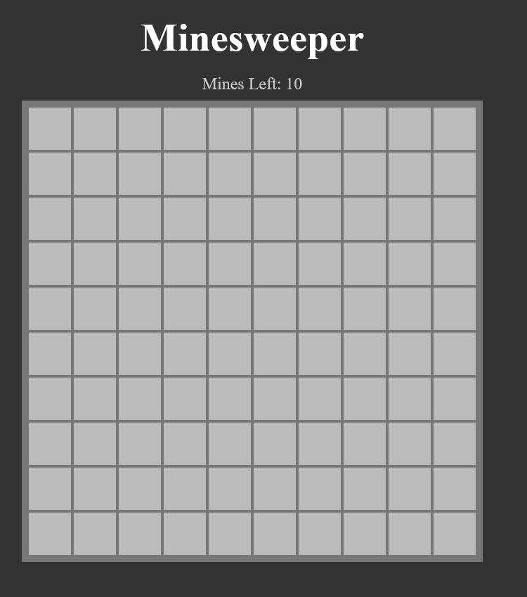

# Minesweeper Game
This is a Full Functioning Minesweeper Game
## Table of contents

- [Overview](#overview)
  - [The Project](#the-challenge)
  - [Screenshot](#screenshot)
  - [Links](#links)
- [My process](#my-process)
  - [Built with](#built-with)
  - [What I learned](#what-i-learned)
  - [Useful resources](#useful-resources)
- [Author](#author)
- [Acknowledgments](#acknowledgments)

## Overview

### The Project
The project is built using HTML, CSS, JavaScript 
and incorperating function programming priciples 
for easier development, navigation and testing.

### Rules:
You win if you are able to reveal all the tiles (non-mine) and mark all the mines.
- Reveal tile - left-click
- Mark tile - right-click
- Un-mark tile - right-click (again)

### Run
To Run the project, first install the packages using `npm install` then run `npm run start` to run the project.

### Tests
The project also has both unit tests, built using Jest testing library with 100% test coverage, and end-to-end tests, using Cypess.
- To run Unit Tests run:
     `npm run test`
- To run end-to-end tests:
     `npm run test:e2e`

### Screenshot

### Links

- Live Site URL: [Add live site URL here](https://your-live-site-url.com)

## My process

### Built with

- Semantic HTML5 markup
- CSS custom properties
- JavaScript
- [Jest](https://jestjs.io/) - JavaScript Testing Library
- [Cypress](https://www.cypress.io/) - End-to-End Testing Library
- [Babel](https://babeljs.io/) - JavaScript Compiler
- [Parcel](https://parceljs.org/) - Build Tool

### What I learned

I learned how to incorporate functional programming principles. 
I also learned how to build tests, both unit and end-to-end tests

### Useful resources

- [Web Dev Simplified Js Course](https://javascriptsimplified.com/) - This helped me for build the project, by teaching me advanced js priciples and concept.

## Author

- Website - [Mondara](https://mondarathotage.com/)
- Linkedin - [@Mondara](https://www.linkedin.com/in/mondara-thotage/)
- Github - [@Mondara](https://github.com/Mondara)

## Acknowledgments

This project was built with the help of Web Dev Simplified Advanced JavaScript Course.

